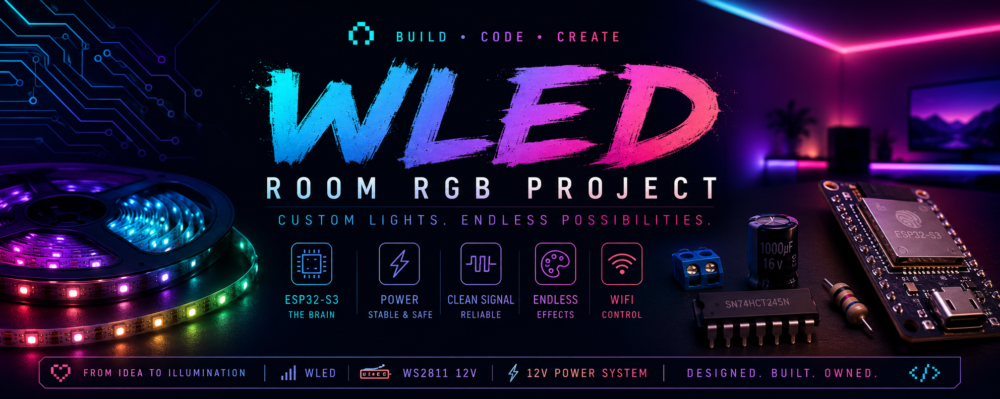

# WLED Room RGB Project

<p align="center">
  
</p>

<p align="center">
  Custom ESP32-S3 powered room lighting setup using WLED and WS2811 LEDs.
</p>

---

## About

I wanted RGB lighting for my room, but almost every prebuilt RGB kit online had the same problems:
- cheap controllers
- bad apps
- limited effects
- questionable quality
- zero expandability

So instead of buying another generic RGB strip, I decided to build my own setup using:
- an ESP32-S3
- WLED
- WS2811 addressable LEDs
- a proper power system

What started as:

> “I just want cool lights”

slowly evolved into:
- power distribution
- voltage conversion
- signal integrity
- current management
- and accidental electrical engineering.

---

# Features

- WLED powered
- WiFi control
- Addressable RGB effects
- Modular architecture
- Expandable setup
- Proper power handling
- Stable signal design
- Power injection support
- Beginner-friendly hardware choices

---

# Hardware

| Part | Description |
|---|---|
| Controller | ESP32-S3 DevKitC-1 N16R8 |
| LEDs | WS2811 12V Addressable RGB Strip |
| PSU | 12V 10A 120W SMPS |
| Buck Converter | LM2596 Step-Down Converter |
| Logic Level Shifter | SN74HCT245N |
| Signal Resistor | 330Ω Metal Film Resistor |
| Capacitor | 1000uF 16V Electrolytic Capacitor |
| Wiring | 18AWG Silicone Wire |

---

# BOM (Bill of Materials)

| Component | Quantity | Cost (INR) | Approx Cost (USD) |
|---|---:|---:|---:|
| WS2811 12V LED Strip (5m, 300 LEDs) | 1 | ₹799 | ~$9.30 |
| ESP32-S3 DevKitC-1 N16R8 | 1 | ₹1150 | ~$13.40 |
| 1000uF 16V Capacitor | 4 | ₹12 | ~$0.14 |
| 330Ω Metal Film Resistor Pack | 1 | ₹187 | ~$2.20 |
| SN74HCT245N Logic Level Shifter | 1 | ₹112 | ~$1.30 |
| Male to Female Jumper Wires + Breadboard | 1 | ₹265 | ~$3.10 |
| 18AWG Silicone Wire (Black) | 1 | ₹34 | ~$0.40 |
| 18AWG Silicone Wire (Red) | 1 | ₹34 | ~$0.40 |
| NHP 12V 10A 120W SMPS | 1 | ₹795 | ~$9.25 |
| LM2596 Buck Converter | 1 | ₹104 | ~$1.20 |

---

## Total Cost

- ₹3,492 INR
- ~$40.70 USD

---

# Why WS2811?

Originally I planned to use WS2812B LEDs, but later realized the strip I selected was actually WS2811 12V.

That ended up being better for this project because:
- lower current draw
- less voltage drop
- easier wiring
- simpler power distribution
- better for longer runs

Tradeoff:
- LEDs are controlled in groups of 3 instead of individually

For room lighting, this is completely fine.

---

# Wiring Overview

```text
12V 10A PSU
   ├── WS2811 LED Strip
   └── LM2596 Buck Converter
            └── ESP32-S3

ESP32 GPIO
   └── 330Ω resistor
         └── SN74HCT245N
               └── LED DIN
```
# Power Injection

Power is injected:
- at the beginning of the strip
- at the end of the strip

This helps prevent:
- voltage drop
- color shifting
- dim LEDs
- unstable brightness

---

# Lessons Learned

This project taught me:
- power matters WAY more than expected
- LEDs consume serious current
- wiring quality matters a LOT
- tiny components prevent huge problems
- not every logic level shifter works properly for LEDs

Biggest realization:

> RGB projects are secretly power engineering projects.

---

# Current Status

- [x] BOM finalized
- [x] Hardware selected
- [x] Power architecture planned
- [ ] WLED installation
- [ ] Breadboard testing
- [ ] Enclosure design
- [ ] Final room installation

---

# Future Plans

- custom 3D printed enclosure
- segmented room zones
- audio reactive effects
- cleaner cable routing
- wall-mounted controller
- custom presets/macros

---


   └── 330Ω resistor
         └── SN74HCT245N
               └── LED DIN
